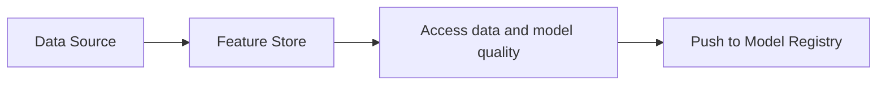
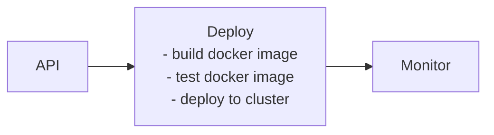

# MLOps (Churn Prediction)

# How to run
```bash
  # brew install uv
  uv run
  docker compose up -d
  code .
  # open ipynb
  # change path of csv file to actual download
  # select kernel ./.venv and run all
```

## Overview

Crate a basic MLOps pipeline for customer churn prediction. 

I have chosen to implement **Model Registry** component and mocked other components including Feature Store, Monitoring, Orchestration, and Deployment systems. 
Feature store is implemented to incorporate both offline features and online features.
Monitoring is divided into 2 parts: Modeling time monitoring and Inference time monitoring. Inference time monitorig is done using api and prometheus while Modeling time monitoring is used to store as model metrics so that it can be visualised later.
Orchestration handles each part separately. Although not implemented it can be acchvied using either python operator or dockerkerized contianer.
API is deployed using CI/CD and tracking metrics are scraped using prometheus.

## Architecture

Basic Flow


Once, the model is ready deploy it on a server and monitor its performance such as latency, inference volume, model version etc.


Orchestrate the retraining on orchestration platform such as Airflow. Schedule, retrain and if criteria is met promote the model with updated version.


## Components Implemented

### 1. Model Registry 

**Why Model Registry**: I chose to implement the Model Registry as the main component because it's foundational for machine learning. Quality accessment, version control, and promoting the model to registry are key aspects that need to be addressed using a model registry module. It is a critical piece of the infrastructure in a machine learning model's lifecycle.

**Features Implemented**:
- **Model Versioning**: model version is automatically incremented if quality is acceptable.
- **Lifecycle Management**: Stage-based model promotion (Staging → Production)
- **Metadata Tracking**: Comprehensive metadata including metrics, parameters, data lineage
- **Model Comparison**: Side-by-side comparison of different model versions
- **Audit Trail**: Complete history of model transitions and changes
- **Artifact Storage**: Secure storage of model binaries and preprocessing pipelines
- **Search & Discovery**: Query models by name, version, stage, or tags

**Database Schema**:
- `models`: Core model metadata and artifacts
- `model_transitions`: Audit trail of stage changes
- `model_experiments`: Links to MLflow experiments

### 2. Feature Store

**Key Features**:
- Point-in-time correct feature retrieval
- Online/offline feature stores for training and inference
- Feature lineage and data quality monitoring

### 3. Monitoring System

**Monitoring Strategy**:
- Data drift is done using the feature store
- Model/Concept drift and Prediction drift are done using the feature store and model registry
- Inference volume, latency etc. are collected using prometheus.

**Monitoring Metrics**:
- **Data Drift**: KL Divergence
- **Prediction Drift**: Jensen-Shannon divergence
- **Concept Drift**: KS test
- **Operational Metrics**: Latency, throughput, error rates, resource utilization

### 4. Orchestration & Retraining

**Retraining Triggers**:
- **Scheduled**: Daily/weekly/monthly retraining cycles
- **Performance-based**: When accuracy drops below threshold
- **Drift-based**: When significant data/concept drift detected

### 5. Deployment & CI/CD

**Deployment Architecture**:

```yaml
# docker-compose.yml
services:
  mlflow:
    image: ghcr.io/mlflow/mlflow:latest

  minio:
    image: minio/minio:latest
  
  redis:
    image: redis:alpine
    
  prometheus:
    image: prom/prometheus
    
  grafana:
    image: grafana/grafana
```

**CI/CD Pipeline** (GitHub Actions):
```yaml
name: Model Deployment Pipeline

on:
  push:
    branches: [main]
  pull_request:
    branches: [main]

jobs:
  test:
    runs-on: ubuntu-latest
    steps:
    - uses: actions/checkout@v2
    - name: Run tests
      run: pytest
  
  deploy-staging:
    needs: test
    runs-on: ubuntu-latest
    steps:
    - name: Deploy to staging
      run: |
        docker build -t mlops:${{ github.sha }} .
        docker push mlops:${{ github.sha }}
        kubectl apply -f k8s/staging/
  
  deploy-production:
    needs: deploy-staging
    if: github.ref == 'refs/heads/main'
    runs-on: ubuntu-latest
    steps:
    - name: Deploy to production
      run: |
        kubectl apply -f k8s/production/
        kubectl set image deployment/mlops mlops=mlops:${{ github.sha }}
```
