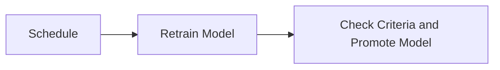

# MLOps (Churn Prediction)

## How to Run

```bash
# Install uv (if not already installed)
brew install uv

# Sync environment
uv sync

# Start services
docker compose up -d

# Open project in VS Code
code .

# Open the notebook (.ipynb)
# Change the path of the CSV file to your actual download location
# Select the kernel from ./.venv and run all cells
```

## Overview

This project sets up a basic MLOps pipeline for customer churn prediction.

I chose to implement the **Model Registry** component fully and mock other components including the Feature Store, Monitoring, Orchestration, and Deployment systems.
The Feature Store is designed to handle both offline and online features.

Monitoring is divided into two parts:

* **Inference-time Monitoring**: Captured via API and Prometheus during real-time prediction.
* **Log-Based Monitoring**: Captures prediction logs and compare it to actual live production data.

Orchestration is designed to handle each pipeline component independently. While not fully implemented, this can be achieved using Python operators or containerized Docker jobs.
The API is deployed using CI/CD, and model performance metrics are scraped using Prometheus.

---

## Architecture

### Basic Flow


Once the model is ready, deploy it to a server and monitor performance metrics such as latency, inference volume, and model version.


Model retraining can be orchestrated on platforms like Airflow. Models are scheduled for retraining and, if criteria are met, promoted to an updated version.



---

## Components Implemented

### 1. Model Registry

**Why Model Registry**:
I chose to implement the Model Registry as the core component because it is foundational to machine learning operations. Model quality assessment, version control, and promotion workflows are all key processes handled by a registry.

**Features Implemented**:

* **Model Versioning**: Automatically increments model version if quality thresholds are met.
* **Lifecycle Management**: Stage-based model promotion (e.g., Staging → Production).
* **Metadata Tracking**: Tracks metrics, parameters, and data lineage.
* **Model Comparison**: Side-by-side comparison of model versions.
* **Audit Trail**: Full history of model changes and stage transitions.
* **Artifact Storage**: Stores model binaries and preprocessing artifacts securely.
* **Search & Discovery**: Search by model name, version, stage, or tags.

**Database Schema**:

* `models`: Core metadata and artifacts.
* `model_transitions`: History of stage changes.
* `model_experiments`: Links to MLflow experiments.

---

### 2. Feature Store

**Key Features**:

* Point-in-time correct feature retrieval.
* Online and offline feature storage for training and inference.
* Feature lineage and data quality monitoring.

---

### 3. Monitoring System

**Monitoring Strategy**:

* **Data Drift**: Detected using the Feature Store.
* **Model/Concept Drift**: Detected via the Feature Store and Model Registry.
* **Operational Metrics**: Latency, throughput, etc., are collected using Prometheus.

**Monitoring Metrics**:

* **Data Drift**: KL Divergence
* **Prediction Drift**: Jensen-Shannon Divergence
* **Concept Drift**: KS Test
* **Operational Metrics**: Latency, throughput, error rates, resource utilization

---

### 4. Orchestration & Retraining

**Retraining Triggers**:

* **Scheduled**: Daily/weekly/monthly retraining
* **Performance-Based**: Triggered when accuracy drops below a threshold
* **Drift-Based**: Triggered upon detection of significant data/concept drift

---

### 5. Deployment & CI/CD

**Deployment Architecture**:

```yaml
# docker-compose.yml
services:
  mlflow:
    image: ghcr.io/mlflow/mlflow:latest

  minio:
    image: minio/minio:latest

  redis:
    image: redis:alpine

  prometheus:
    image: prom/prometheus

  grafana:
    image: grafana/grafana
```

**CI/CD Pipeline** (GitHub Actions):

```yaml
name: Model Deployment Pipeline

on:
  push:
    branches: [main]
  pull_request:
    branches: [main]

jobs:
  test:
    runs-on: ubuntu-latest
    steps:
      - uses: actions/checkout@v2
      - name: Run tests
        run: pytest

  deploy-staging:
    needs: test
    runs-on: ubuntu-latest
    steps:
      - name: Deploy to staging
        run: |
          docker build -t mlops:${{ github.sha }} .
          docker push mlops:${{ github.sha }}
          kubectl apply -f k8s/staging/

  deploy-production:
    needs: deploy-staging
    if: github.ref == 'refs/heads/main'
    runs-on: ubuntu-latest
    steps:
      - name: Deploy to production
        run: |
          kubectl apply -f k8s/production/
          kubectl set image deployment/mlops mlops=mlops:${{ github.sha }}
```

---
